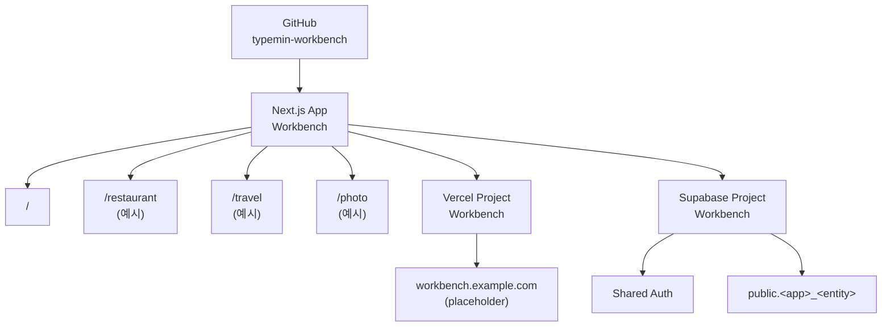
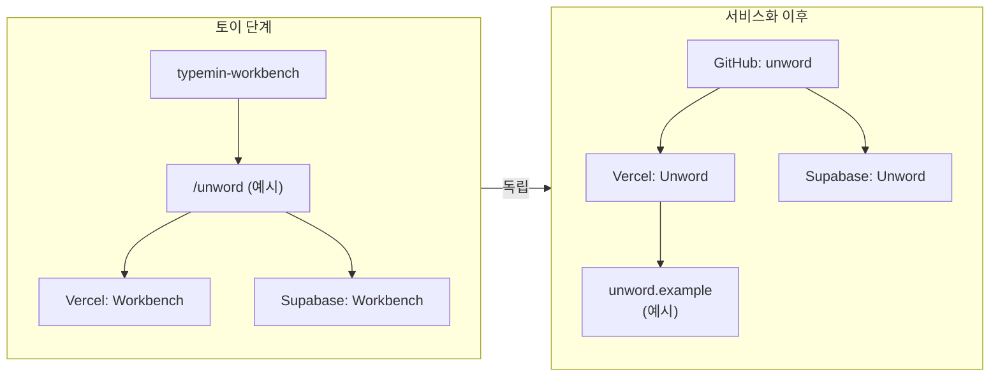

# Workbench 아키텍처

이 문서는 `typemin-workbench`의 구조와 운영 원칙을 정의하는 정본입니다. 구현 과정에서 다른 문서나 예시와 충돌하면 이 문서를 우선합니다.

## 1. 목적

Workbench는 여러 아이디어를 토이 웹앱으로 빠르게 만들고 실제로 사용해 보는 개인 개발 공간입니다. 초기 관리 비용을 낮추기 위해 토이 단계에서는 코드, 배포, 데이터, 인증, 도메인을 하나로 통합합니다.

앱이 독립적인 사용자, 데이터, 배포 주기 또는 브랜드를 가질 만큼 성장했을 때만 Workbench 밖으로 분리합니다.

## 2. 자원 구성

| 영역         | 이름                | 토이 단계 구성             |
| ------------ | ------------------- | -------------------------- |
| GitHub       | `typemin-workbench` | 저장소 1개                 |
| 애플리케이션 | `Workbench`         | Next.js 앱 1개             |
| 배포         | `Workbench`         | Vercel 프로젝트 1개        |
| 백엔드       | `Workbench`         | Supabase 프로젝트 1개      |
| 웹 주소      | 미정                | 도메인 1개와 앱별 서브패스 |

`workbench.example.com`은 문서에서 사용하는 placeholder이며 실제 도메인이 아닙니다. 실제 도메인이 정해지면 문서의 placeholder를 일괄 교체합니다.



`restaurant`, `travel`, `photo`, `unword`는 이 문서에서 구조를 설명하기 위한 예시일 뿐입니다. 실제 라우트, 테이블 또는 인프라 자원으로 생성하지 않습니다.

## 3. URL과 라우트 규칙

모든 토이 앱은 단일 도메인의 최상위 서브패스를 사용합니다.

```text
홈       https://workbench.example.com/
토이 앱  https://workbench.example.com/<app-name>
```

앱 이름은 URL에서 소문자 kebab-case slug로 표현합니다. Next.js App Router에서는 폴더 하나가 URL 세그먼트 하나에 대응하며, `page.tsx`가 있는 세그먼트만 공개 페이지가 됩니다.

```text
typemin-workbench/
├── app/
│   ├── layout.tsx
│   ├── page.tsx
│   └── <app-name>/
│       ├── page.tsx
│       ├── _components/
│       └── _lib/
├── components/
├── lib/
└── ...
```

예시 대응 관계는 다음과 같습니다.

| 구분         | 값                                             |
| ------------ | ---------------------------------------------- |
| 앱 이름      | Restaurant Log                                 |
| URL slug     | `restaurant-log`                               |
| Next.js 경로 | `app/restaurant-log/page.tsx`                  |
| 공개 URL     | `https://workbench.example.com/restaurant-log` |
| DB 접두사    | `restaurant_log_`                              |
| 테이블 예시  | `public.restaurant_log_entries`                |

폴더와 파일의 책임은 다음과 같이 구분합니다.

- `app/<app-name>/`: 특정 앱의 라우트와 전용 구현을 둡니다.
- `app/<app-name>/_components/`: 해당 앱에서만 사용하는 UI를 둡니다. `_` 접두사는 라우팅 대상이 아닌 구현 세부사항임을 나타냅니다.
- `app/<app-name>/_lib/`: 해당 앱에서만 사용하는 데이터 접근과 도메인 로직을 둡니다.
- `components/`: 둘 이상의 앱에서 실제로 재사용하는 공통 UI만 둡니다.
- `lib/`: 인증 클라이언트, 공통 유틸리티 등 앱에 종속되지 않는 코드만 둡니다.

앱 전용 코드는 처음부터 공통 폴더에 넣지 않습니다. 두 앱 이상에서 같은 책임으로 재사용되는 것이 확인된 뒤 공통 영역으로 이동합니다.

Next.js 파일 구조의 세부 동작은 [공식 App Router 프로젝트 구조 문서](https://nextjs.org/docs/app/getting-started/project-structure)를 따릅니다.

## 4. Supabase 데이터 경계

모든 토이 앱은 하나의 Supabase 프로젝트와 Auth를 공유합니다. 사용자는 Workbench 수준의 하나의 계정을 사용하며, 앱별 데이터는 `public` 스키마의 테이블 이름으로 논리적으로 구분합니다.

### 명명 규칙

- URL의 kebab-case slug를 DB에서 snake_case로 변환합니다.
- 테이블 이름은 `<app>_<entity>` 형식을 사용합니다.
- 앱 전용 뷰, 함수, 스토리지 버킷 등에도 같은 앱 접두사를 사용합니다.
- 공통 사용자 프로필처럼 둘 이상의 앱이 공유하는 데이터에만 `workbench_` 접두사를 사용합니다.

```text
/restaurant-log            -> public.restaurant_log_entries
/travel-planner            -> public.travel_planner_trips
/photo-notes               -> public.photo_notes_albums
```

위 이름은 규칙을 설명하기 위한 예시이며 실제 테이블이 아닙니다.

### 접근 제어 규칙

테이블 생성과 Data API 노출은 별개의 작업으로 취급합니다. 새 테이블이 자동으로 Data API에 노출되거나 클라이언트 역할에 권한이 부여된다고 가정하지 않습니다.

앱별 데이터 모델을 구현할 때는 다음 항목을 같은 마이그레이션에서 명시합니다.

1. 테이블과 제약 조건을 생성합니다.
2. Row Level Security(RLS)를 활성화합니다.
3. `anon`, `authenticated`에 필요한 최소 권한만 `GRANT`합니다.
4. 앱의 실제 소유권과 공개 범위에 맞는 RLS 정책을 만듭니다.
5. `UPDATE` 정책에는 조회 권한과 함께 `USING`, `WITH CHECK` 조건을 모두 검토합니다.
6. 관리자용 secret 또는 `service_role` 자격 증명은 브라우저에 노출하지 않습니다.

인증되었다는 사실만으로 모든 행을 허용하지 않습니다. 사용자 소유 데이터는 `auth.uid()`와 소유자 열을 비교하는 방식처럼 앱의 권한 모델을 정책에 명시해야 합니다. 권한과 RLS의 최신 세부사항은 [Supabase API 보안 문서](https://supabase.com/docs/guides/api/securing-your-api)와 [RLS 공식 문서](https://supabase.com/docs/guides/database/postgres/row-level-security)를 따릅니다.

Supabase의 Data API 기본 노출 정책은 변경될 수 있으므로 구현 전 [breaking changes](https://supabase.com/changelog?types=breaking-change)를 확인합니다.

## 5. 토이 단계와 서비스화 단계

| 구분     | 토이 단계                          | 서비스화 이후           |
| -------- | ---------------------------------- | ----------------------- |
| GitHub   | `typemin-workbench`에 통합         | 앱 전용 저장소          |
| Next.js  | Workbench의 하위 라우트            | 앱 전용 애플리케이션    |
| Vercel   | `Workbench` 프로젝트               | 앱 전용 프로젝트        |
| Supabase | `Workbench` 프로젝트와 공유 Auth   | 앱 전용 프로젝트와 Auth |
| URL      | `workbench.example.com/<app-name>` | 앱 전용 도메인          |

예를 들어 `/unword`가 독립한다고 가정하면 구조는 다음처럼 바뀝니다. `unword`는 독립 절차를 설명하기 위한 예시입니다.



### 독립 판단 기준

다음 항목 중 하나 이상이 지속적으로 나타나고, 분리 비용보다 독립 가치가 크면 서비스화를 검토합니다.

- Workbench와 구분되는 사용자층이나 제품 정체성이 생겼습니다.
- 데이터 보존, 권한 또는 규정 요구사항을 별도로 운영해야 합니다.
- 배포 주기, 장애 영향 범위 또는 성능 요구사항을 분리해야 합니다.
- 독립 도메인과 브랜드가 사용자 경험이나 배포 목적에 실질적인 이점을 줍니다.

단순히 코드가 커졌다는 이유만으로는 분리하지 않습니다. 앱 전용 코드를 라우트 내부에 응집시켜 둔 뒤 독립 가치가 확인되었을 때 옮깁니다.

### 독립 체크리스트

- [ ] 앱 전용 코드를 새 저장소로 이동하고 Workbench 공통 코드 의존성을 제거하거나 복제합니다.
- [ ] 새 Next.js 앱의 환경변수와 빌드 설정을 정의합니다.
- [ ] 앱 전용 Vercel 프로젝트를 만들고 새 저장소를 연결합니다.
- [ ] 앱 전용 Supabase 프로젝트를 만들고 스키마, RLS 정책, Auth 설정을 이전합니다.
- [ ] 필요한 사용자와 앱 데이터의 마이그레이션 및 검증 절차를 수립합니다.
- [ ] 앱 전용 도메인을 연결하고 기존 서브패스의 리다이렉트 정책을 정합니다.
- [ ] Workbench에서 이전한 라우트, 테이블, 비밀키와 사용하지 않는 자원을 제거합니다.
- [ ] 독립 서비스의 배포, 인증, 주요 사용자 흐름을 검증합니다.

## 6. 현재 범위

현재 단계에서는 운영 원칙만 문서화합니다. 다음 항목은 아직 생성하거나 설정하지 않습니다.

- Git 저장소와 GitHub 원격 저장소
- Next.js scaffold, 앱 라우트, 패키지와 환경변수
- Vercel 및 Supabase 프로젝트
- 데이터베이스 테이블과 Auth 설정
- 실제 도메인과 DNS

첫 번째 실제 앱이 정해지면 이 문서를 기준으로 Workbench의 실행 가능한 골격을 별도 단계에서 구성합니다.
