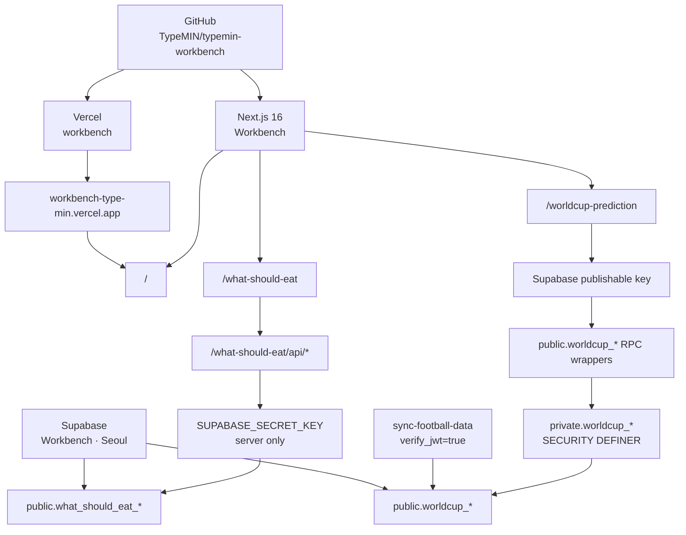

# Workbench 아키텍처

이 문서는 `typemin-workbench`의 코드, 배포와 데이터 경계를 정의하는 정본입니다.

## 1. 자원 구성

| 영역         | 이름                            | 구성                                       |
| ------------ | ------------------------------- | ------------------------------------------ |
| GitHub       | `TypeMIN/typemin-workbench`     | 저장소 1개, `main`이 프로덕션              |
| 애플리케이션 | `Workbench`                     | Next.js App Router 앱 1개                  |
| 배포         | `workbench`                     | Vercel 프로젝트 1개, 기능 브랜치는 Preview |
| 백엔드       | `Workbench`                     | Supabase 프로젝트 1개, `ap-northeast-2`    |
| 웹 주소      | `workbench-type-min.vercel.app` | 앱별 최상위 서브패스                       |

`workbench.example.com`은 커스텀 도메인이 정해지기 전까지 문서에서만 쓰는 placeholder입니다.



## 2. 공개 URL과 라우트

| 책임         | 경로                     |
| ------------ | ------------------------ |
| Workbench 홈 | `/`                      |
| 식사 앱      | `/what-should-eat`       |
| 월드컵 앱    | `/worldcup-prediction`   |
| 식사 앱 API  | `/what-should-eat/api/*` |

식사 앱 API는 다른 Workbench 앱의 `/api/*`와 충돌하지 않도록 앱 경로 아래에 둡니다. 앱 slug는 소문자 kebab-case, 데이터베이스 접두사는 대응하는 snake_case를 사용합니다.

```text
/restaurant-log -> public.restaurant_log_entries
```

`restaurant-log`는 명명 규칙을 설명하는 예시이며 실제 라우트나 테이블이 아닙니다.

## 3. 코드 경계

```text
typemin-workbench/
├── app/
│   ├── page.tsx
│   ├── what-should-eat/
│   │   ├── api/
│   │   ├── layout.tsx
│   │   ├── page.tsx
│   │   └── styles.css
│   └── worldcup-prediction/
│       ├── layout.tsx
│       ├── page.tsx
│       └── styles.css
├── components/
│   └── what-should-eat/
├── lib/
│   ├── supabase/
│   ├── what-should-eat/
│   └── worldcup-prediction/
├── supabase/
│   ├── functions/
│   └── migrations/
└── tests/e2e/
```

- `app/<app-name>`에는 앱의 라우트, metadata와 라우트 전용 CSS를 둡니다.
- `components/<app-name>`과 `lib/<app-name>`에는 해당 앱만 사용하는 UI와 도메인 로직을 둡니다.
- `lib/supabase`에는 두 앱이 공유하는 설정과 클라이언트 생성 코드만 둡니다.
- 둘 이상의 앱에서 실제로 같은 책임으로 재사용되는 코드만 루트 공통 모듈로 승격합니다.
- 앱 CSS는 각각 `.what-should-eat-app`, `.worldcup-prediction-app` 아래로 제한합니다.
- 식사 앱의 `what_should_eat_session` 쿠키는 `Path=/what-should-eat`로 제한합니다.

새 앱은 Next.js App Router의 [공식 프로젝트 구조](https://nextjs.org/docs/app/getting-started/project-structure)에 맞춰 `app/<app-name>/page.tsx`로 추가합니다.

## 4. Supabase 데이터와 권한

두 앱은 Supabase 프로젝트를 공유하지만 현재 Supabase Auth는 사용하지 않습니다. 식사 앱은 자체 서버 세션, 월드컵 앱은 참가자·관리자 PIN 모델을 유지합니다.

### 식사 앱

- `what_should_eat_users`
- `what_should_eat_sessions`
- `what_should_eat_decisions`
- `what_should_eat_decision_participants`
- `what_should_eat_place_feedback`
- `what_should_eat_comparisons`

여섯 테이블은 빈 상태로 시작합니다. 브라우저 역할에는 직접 테이블 권한을 부여하지 않고, Vercel 서버의 `SUPABASE_SECRET_KEY`를 사용하는 식사 앱 API만 접근합니다.

### 월드컵 앱

- `worldcup_settings`: 설정 1건
- `worldcup_participants`: 빈 참가 슬롯 5개
- `worldcup_matches`: 기본 경기 브래킷 32건
- `worldcup_predictions`: 빈 상태
- `worldcup_events`: Realtime 갱신 알림

`anon`은 이벤트 조회와 공개 RPC wrapper 실행만 할 수 있습니다. 직접 테이블 접근은 차단합니다. `SECURITY DEFINER` 구현 함수는 `private` 스키마에 두고 빈 `search_path`, 내부 PIN 검증, `PUBLIC` 실행 권한 회수와 함수별 최소 `GRANT`를 적용합니다.

관리자 PIN은 기존 동작을 유지하기 위해 `0000`입니다. 공개 사용자가 값을 추측해 참가자·경기 설정과 결과를 바꿀 수 있는 위험이 있으므로 임시 운영 값으로 취급하고 공개 공유 범위를 제한해야 합니다.

### 공통 규칙

모든 공개 스키마 테이블은 다음을 같은 마이그레이션에서 정의합니다.

1. 테이블, 제약 조건과 필요한 인덱스
2. RLS 활성화와 앱별 정책
3. `anon`, `authenticated`, `service_role`의 명시적 `GRANT` 또는 `REVOKE`
4. 함수의 실행 주체, `search_path`와 최소 실행 권한

신규 테이블의 Data API 자동 노출을 가정하지 않습니다. 자세한 기준은 [Supabase 변경사항](https://supabase.com/changelog/45329-breaking-change-tables-not-exposed-to-data-and-graphql-api-automatically)과 [RLS 공식 문서](https://supabase.com/docs/guides/database/postgres/row-level-security)를 따릅니다.

## 5. 경기 데이터 동기화

`supabase/functions/sync-football-data`는 `verify_jwt=true`로 배포합니다. `FOOTBALL_DATA_TOKEN`은 설정하지 않았고 `NEXT_PUBLIC_WORLDCUP_SYNC_ENABLED=false`이므로 자동 동기화 UI를 비활성화합니다.

새 football-data.org 토큰을 준비하면 다음 값만 설정해 활성화할 수 있습니다.

- Supabase Edge Function secret `FOOTBALL_DATA_TOKEN`
- Supabase Edge Function secret `FOOTBALL_DATA_SEASON=2026`
- Vercel 환경변수 `NEXT_PUBLIC_WORLDCUP_SYNC_ENABLED=true`

## 6. 배포 흐름

- GitHub `main`은 Vercel Production에 연결합니다.
- 기능 브랜치의 push와 Pull Request는 Preview 배포를 만듭니다.
- Preview에서 `npm run check`, E2E와 Supabase 권한 검증을 통과한 뒤 `main`에 병합합니다.
- `.vercel/project.json`은 고정 버전 Vercel CLI로 로컬 프로젝트를 연결할 때 만들며 `.vercel/`은 커밋하지 않습니다.
- Supabase 스키마는 `supabase/migrations`의 수동 마이그레이션으로 관리하고 GitHub 기반 DB 브랜칭은 사용하지 않습니다.

## 7. 앱 독립 기준

사용자, 데이터, 배포 주기 또는 브랜드를 Workbench와 분리할 실질적 가치가 생기고 분리 비용보다 독립 가치가 큰 앱만 서비스화합니다.

- [ ] 앱 전용 코드를 새 저장소로 옮기고 공통 코드 의존성을 정리합니다.
- [ ] 앱 전용 Vercel 프로젝트와 환경변수를 만듭니다.
- [ ] 앱 전용 Supabase 프로젝트에 스키마, 정책과 필요한 데이터를 이전합니다.
- [ ] 앱 전용 도메인을 연결하고 기존 서브패스의 리다이렉트를 정의합니다.
- [ ] 새 배포의 인증, 데이터와 주요 사용자 흐름을 검증합니다.
- [ ] 롤백 기간 뒤 Workbench의 이전 코드, 데이터와 비밀키를 제거합니다.

## 8. 마이그레이션 원본

- 식사 앱: `TypeMIN/project-what-should-eat`의 `8d3c6a67db82892520fc7c752b10f724e75b52cd`
- 월드컵 앱: `TypeMIN/worldcup-prediction` PR #1을 squash merge한 `main`의 `d364f2d`

원본 저장소의 루트 템플릿과 에이전트 설정은 가져오지 않았습니다. 기존 운영 데이터도 Workbench로 이전하지 않았습니다.
